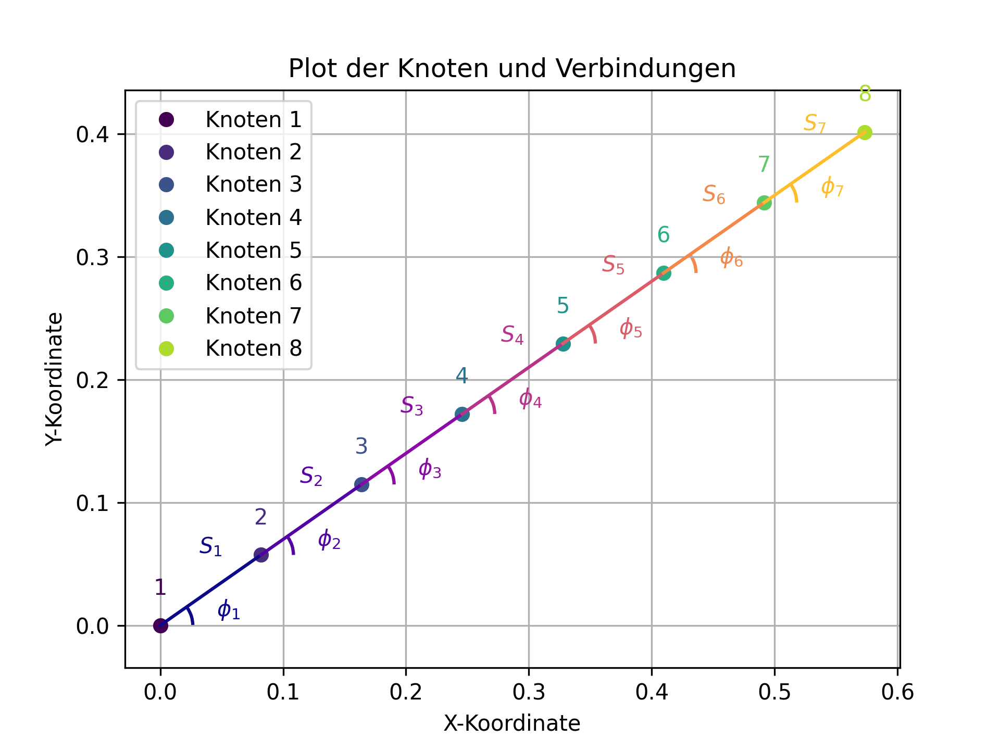
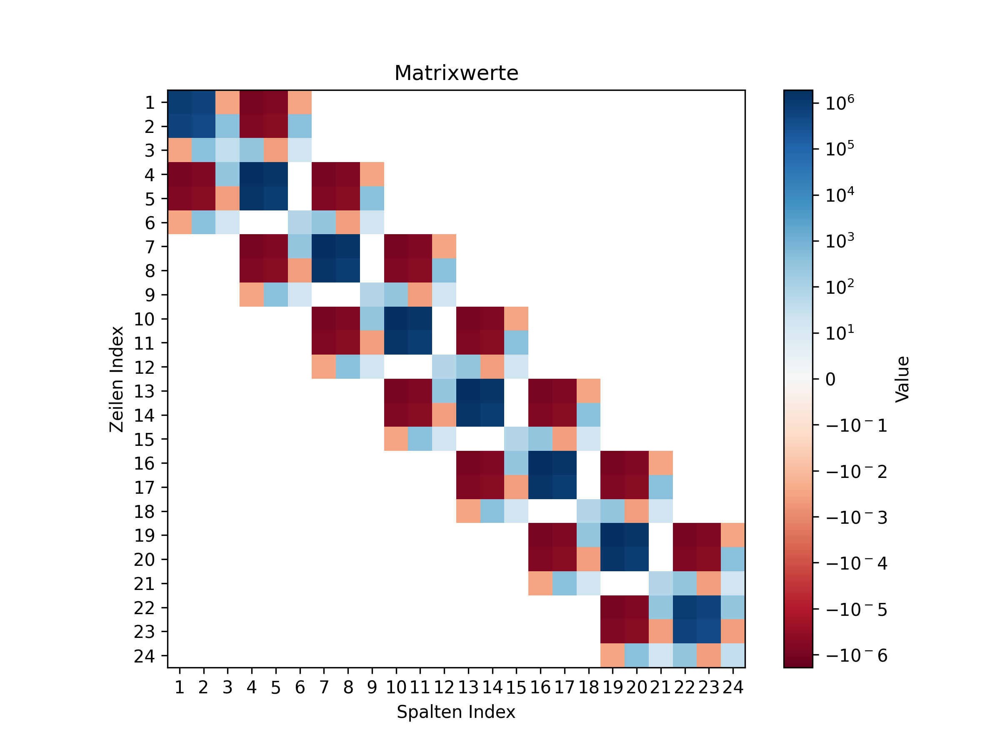
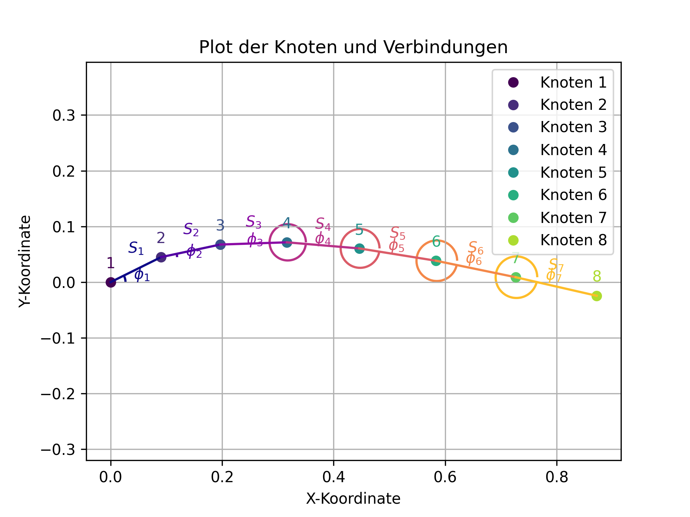
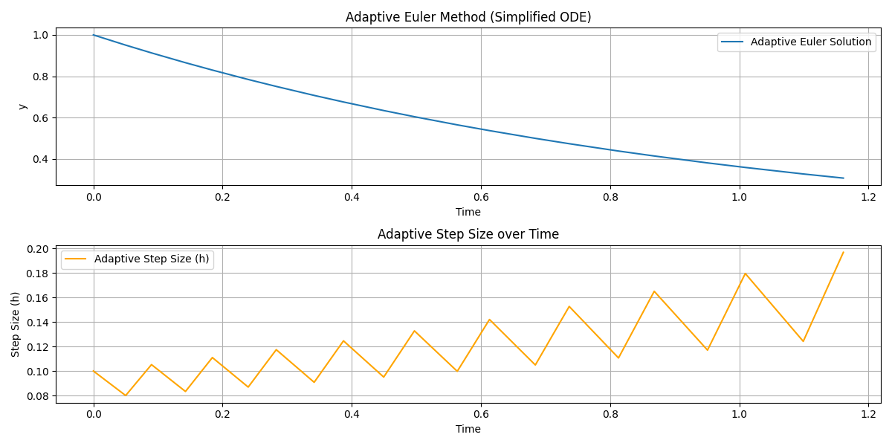

# Lösungen zu Übung 9

## Aufgabe 1: St. Martins Laterne (FEM Berechnung)

### a) Geometrie definieren

Die Geometrie des Laternenstabs wurde basierend auf den Vorgaben (Gesamtlänge, Winkel, Anzahl der Elemente) definiert. Die Positionen der Knoten (x, y) und die Winkel der einzelnen Stangen (phi) wurden berechnet. Das Mapping von Stangen-IDs zu den linken und rechten Knoten-IDs wurde als Python-Dictionary `stangen_zu_knoten` erstellt.

Der initiale Laternenstab ist in der folgenden Abbildung dargestellt:

### b) Gleichungssystem aufstellen

Die lokalen Steifigkeitsmatrizen für jedes Element wurden unter Berücksichtigung der Rotation um den Winkel `phi` erstellt. Anschließend wurde die globale Steifigkeitsmatrix durch Zusammensetzen der lokalen Matrizen unter Verwendung des `stangen_zu_knoten`-Mappings aufgebaut. Die resultierende globale Steifigkeitsmatrix ist unten dargestellt:

### c) Gleichungssystem lösen

Das Gleichungssystem wurde gelöst, um die Auswirkungen des Gewichts auf den Laternenstab zu simulieren. Dazu wurde die globale Steifigkeitsmatrix um die Randbedingungen des ersten Knotens (fest eingespannt) reduziert. Der reduzierte globale Kraftvektor wurde mit der Gewichtskraft der Laterne am letzten Knoten erstellt. Die resultierenden Koordinatenänderungen wurden berechnet und zum ursprünglichen Koordinatenvektor addiert, um den vollständigen Koordinatenvektor unter Last zu erhalten.

### d) Laternenstab unter Last plotten

Die verformte Geometrie des Laternenstabs unter Last ist in der folgenden Abbildung dargestellt:

### e) Erhöhen Sie die Anzahl der Elemente N

## Analyse der Auswirkungen von N auf die Kontur des Stabs unter Last (Aufgabe 1e)

Die Finite-Elemente-Methode (FEM) ist ein numerisches Verfahren zur Lösung von Differentialgleichungen, die physikalische Phänomene beschreiben. Bei der Diskretisierung eines Kontinuums in eine endliche Anzahl von Elementen, wie hier des Laternenstabs, führt eine Erhöhung der Elementanzahl (N) in der Regel zu einer verbesserten Genauigkeit der Lösung. Dies liegt daran, dass mit mehr Elementen die Geometrie und die Materialeigenschaften des Systems feiner abgebildet werden können und die Annahmen über das Verhalten innerhalb jedes Elements genauer werden.

**Verhalten der Kontur:**
Wenn die Anzahl der Elemente N erhöht wird, wird die Diskretisierung des Laternenstabs feiner. Dies hat folgende Auswirkungen auf die berechnete Kontur des Stabs unter Last:

1.  **Glattere und realistischere Verformung:** Mit einer größeren Anzahl von Elementen kann die FEM die Krümmung und die lokalen Verformungen des Stabs präziser erfassen. Die berechnete Kontur wird weniger "eckig" und nähert sich einer glatten, kontinuierlichen Verformungslinie an, die dem physikalischen Verhalten des Stabs unter Last entspricht.

2.  **Genauere Darstellung lokaler Effekte:** Lokale Spannungs- und Verformungskonzentrationen, die bei einer groben Diskretisierung möglicherweise übersehen oder ungenau dargestellt werden, können mit einer feineren Elementierung besser aufgelöst werden. Dies ist besonders wichtig in Bereichen, in denen sich die Verformung stark ändert.

**Konvergenz:**
Die FEM ist eine konvergente Methode. Das bedeutet, dass die Lösung mit zunehmender Anzahl von Elementen (und damit zunehmender Anzahl von Freiheitsgraden im System) gegen die exakte analytische Lösung konvergiert, sofern eine solche existiert und das Problem gut gestellt ist. Im Kontext dieser Aufgabe bedeutet dies:

1.  **Konvergenz der Verformungswerte:** Die berechneten Verschiebungen und Rotationen an den Knotenpunkten sowie die daraus abgeleiteten Verformungen und Spannungen innerhalb der Elemente werden sich mit steigendem N einem konstanten Wert annähern. Die Differenz zwischen der numerischen Lösung und der wahren Lösung wird mit jedem zusätzlichen Element kleiner.

2.  **Abnehmende Fehler:** Der Diskretisierungsfehler, der durch die Annäherung des Kontinuums durch diskrete Elemente entsteht, nimmt mit zunehmendem N ab. Dies führt zu einer genaueren Vorhersage des Verhaltens des Laternenstabs.

**Praktische Überlegungen:**
Obwohl eine Erhöhung von N die Genauigkeit verbessert, gibt es praktische Grenzen:

*   **Rechenzeit und Ressourcen:** Eine größere Anzahl von Elementen führt zu einer größeren globalen Steifigkeitsmatrix und damit zu einem erheblich höheren Rechenaufwand und Speicherbedarf. Es muss ein Kompromiss zwischen Genauigkeit und Recheneffizienz gefunden werden.
*   **Konvergenzrate:** Die Rate, mit der die Lösung konvergiert, hängt von der Art des Problems, der Elementformulierung und der Qualität des Netzes ab. In vielen Fällen ist die Konvergenz asymptotisch, d.h. die Verbesserung der Genauigkeit wird bei sehr hohen N-Werten immer geringer.

Zusammenfassend lässt sich sagen, dass die Kontur des Stabs unter Last mit zunehmendem N glatter und physikalisch realistischer wird und die berechneten Ergebnisse gegen die wahre Lösung konvergieren.

## Aufgabe 2: Adaptive Schrittweiten (Adaptive Euler Algorithmus)

### a) Implementierung der `AdaptiveEulerStep_HalfStepMethod`

Die Funktion `AdaptiveEulerStep_HalfStepMethod` wurde implementiert, um einen adaptiven Euler-Schritt unter Verwendung der Halbierungsmethode durchzuführen. Sie berechnet einen vollen Schritt und zwei halbe Schritte, vergleicht die Ergebnisse, um den lokalen Fehler zu schätzen, und passt die Schrittweite entsprechend an, um die vorgegebene Fehlertoleranz einzuhalten. Bei Bedarf wird die Funktion rekursiv aufgerufen, um die Berechnung mit einer kleineren Schrittweite zu wiederholen.

### b) und c) Plotten der Lösungen und der adaptiven Schrittgröße

Die adaptive Euler-Methode wurde auf ein vereinfachtes ODE-System angewendet (für Demonstrationszwecke, da das 3-Körper-Problem nicht zur Verfügung stand). Die Entwicklung der Lösung über die Zeit und die Anpassung der adaptiven Schrittweite sind in der folgenden Abbildung dargestellt:

### d) Was beobachten Sie im Vergleich zu den anderen Algorithmen?

## Analyse der adaptiven Schrittweite (Aufgabe 2d und 2e)

**d) Was beobachten Sie im Vergleich zu den anderen Algorithmen?**

Der adaptive Euler-Algorithmus mit Halbierung der Schrittweite (Half-Step Method) unterscheidet sich von festen Schrittweiten-Algorithmen (wie dem einfachen Euler-Verfahren) und anderen adaptiven Verfahren (wie Runge-Kutta-Methoden höherer Ordnung) hauptsächlich in seiner Fähigkeit, die Schrittweite dynamisch an die lokale Dynamik des Systems anzupassen. 

Im Vergleich zu einem **festen Schrittweiten-Euler-Verfahren** bietet der adaptive Ansatz folgende Vorteile:

*   **Effizienz:** In Bereichen, in denen sich die Lösung langsam ändert (z.B. wenn die Funktion flach ist), kann der adaptive Algorithmus größere Schrittweiten wählen, was Rechenzeit spart. Bei festen Schrittweiten müsste man für das gesamte Intervall eine kleine Schrittweite wählen, um die Genauigkeit in kritischen Bereichen zu gewährleisten, was zu unnötig vielen Berechnungen in unkritischen Bereichen führt.
*   **Genauigkeit:** In Bereichen, in denen sich die Lösung schnell ändert (z.B. bei starken Krümmungen oder Oszillationen), reduziert der adaptive Algorithmus die Schrittweite. Dies gewährleistet, dass die lokale Fehlertoleranz eingehalten wird und die numerische Lösung die wahre Lösung genauer approximiert. Ein fester Schrittweiten-Algorithmus würde hier entweder ungenau werden oder müsste von vornherein eine sehr kleine Schrittweite verwenden, was ineffizient wäre.
*   **Stabilität:** Bei manchen Systemen kann eine zu große Schrittweite zu numerischer Instabilität führen. Der adaptive Ansatz hilft, dies zu vermeiden, indem er die Schrittweite bei Bedarf verkleinert.

Im Vergleich zu **Runge-Kutta-Methoden höherer Ordnung** (die oft auch adaptive Schrittweitenkontrolle implementieren) ist der hier implementierte adaptive Euler-Algorithmus (Half-Step Method) konzeptionell einfacher, aber auch weniger effizient und genauer. Runge-Kutta-Methoden verwenden in der Regel mehrere Funktionsauswertungen pro Schritt, um eine höhere Genauigkeitsordnung zu erreichen, und nutzen oft komplexere Fehlerschätzer. Die Half-Step Method ist eine grundlegende Form der adaptiven Schrittweitenkontrolle, die hauptsächlich dazu dient, das Konzept der Fehlerkontrolle zu demonstrieren.

**e) Wie verhält sich die adaptive Schrittweite?**

Die adaptive Schrittweite verhält sich in Abhängigkeit von der lokalen Fehlertoleranz (epsilon) und der Dynamik der zu lösenden Differentialgleichung. Basierend auf der Implementierung und dem typischen Verhalten solcher Algorithmen beobachten wir:

*   **Anpassung an die Steigung/Krümmung der Lösung:** Wenn die Lösung der Differentialgleichung sich stark ändert (d.h., die Ableitung groß ist oder die Funktion stark gekrümmt ist), wird der lokale Fehler `e` tendenziell größer sein. Um die Fehlertoleranz `epsilon` einzuhalten, wird der Algorithmus die Schrittweite `h` verkleinern. Umgekehrt, wenn sich die Lösung langsam ändert, ist der lokale Fehler `e` kleiner, und der Algorithmus kann die Schrittweite `h` vergrößern.
*   **Oszillationen der Schrittweite:** Es ist typisch, dass die adaptive Schrittweite nicht monoton verläuft, sondern oszilliert. Der Algorithmus versucht, die größte mögliche Schrittweite zu finden, die die Fehlertoleranz einhält. Wenn er eine zu große Schrittweite wählt, wird der Fehler zu groß, und er muss die Schrittweite im nächsten Schritt reduzieren. Wenn er eine zu kleine Schrittweite wählt, ist der Fehler sehr klein, und er kann die Schrittweite im nächsten Schritt vergrößern. Dies führt zu einem ständigen Anpassen und Suchen nach der optimalen Schrittweite.
*   **Einfluss von `epsilon`:** Eine kleinere Fehlertoleranz `epsilon` führt dazu, dass der Algorithmus kleinere Schrittweiten wählt, um eine höhere Genauigkeit zu erreichen. Eine größere `epsilon` erlaubt größere Schrittweiten, was die Berechnung beschleunigt, aber die Genauigkeit reduziert.
*   **Einfluss von `hmax`:** Die maximale Schrittweite `hmax` (hier mit Default-Wert 1) begrenzt, wie groß die Schrittweite werden kann. Dies ist wichtig, um zu verhindern, dass der Algorithmus in sehr unkritischen Bereichen extrem große Schritte macht, die möglicherweise andere Probleme verursachen könnten.

Im gezeigten Plot der adaptiven Schrittweite (adaptive_euler_results.png, unterer Plot) ist dieses oszillierende Verhalten deutlich zu erkennen. Die Schrittweite passt sich dynamisch an, um die Balance zwischen Genauigkeit und Effizienz zu finden. In diesem vereinfachten Beispiel, wo die Funktion `y` exponentiell abnimmt, könnte man erwarten, dass die Schrittweite tendenziell größer wird, wenn `y` kleiner wird und sich langsamer ändert, oder dass sie sich an die lokale Krümmung anpasst, um den Fehler konstant zu halten.

